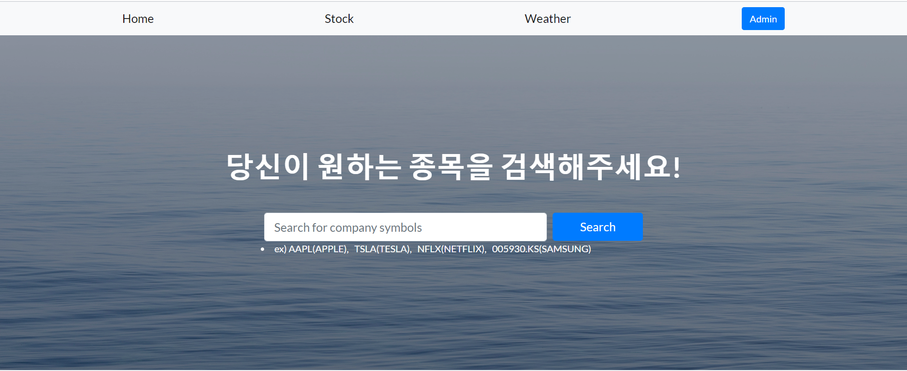
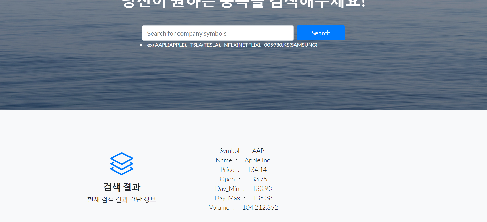
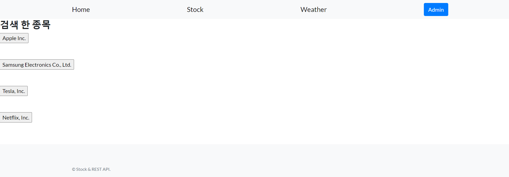

# Yahoo Stock

Django로 사이트를 제작 후 Scrapy로 검색한 종목의 데이터를 가져와 DB에 저장 후 사이트에 출력

> Tool

- Language : Python
- IDE : Pycharm, Jupyter Notebook
- Library : Scrapy
- DB : Sqlite3
- Web Tool : HTML / CSS / Bootstrap
- Web Framework : Django

# Main

검색 창에 원하는 종목코드를 입력후 Search를 클릭하면 밑의 그림과 같이 결과가 나옵니다.

# Stock

상단 메뉴판에서 Stock을 클릭시 지금까지 검색했던 종목을 DB에서 가져와 출력합니다.

버튼을 클릭시 그 종목의 세부 정보를 출력합니다.

# Source Code

- mysite - Django start project
- stock  - Django blog
- yahoo_stock : Scrapy project

# Improvements

1. 아직 검색창에서 종목을 입력 후 Search 클릭시 Scrapy 파일로 값을 전달 후 그 값에따라 Scrapy동작을 구현하지 못하여 개선할 부분입니다.
2. Stock 페이지에서 종목 이름 버튼을 클릭하면 세부정보를 불러올때 최신 정보를 불러오도록 설정을 하고싶습니다.
3. 처음부터 끝까지 혼자 해보면서 문제해결능력을 많이 길렀다고 생각하고 제가 원하는 기술들을 추가하고싶을때마다 공부를 통해 적용을 할 때 더 배우는것을 느꼈습니다. 앞으로 더 공부해서 조금 더 좋은 사이트를 만들어보고 싶습니다.

